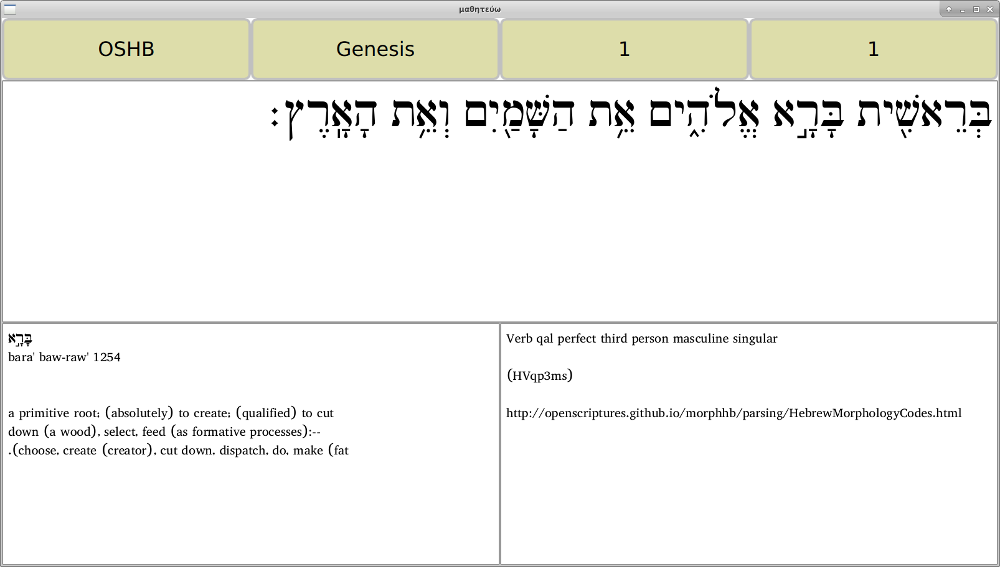

Matheteuo display a single verse of the Bible and gives access to Strong's definition as well as morphological informations when clicking on a word.

The idea is to automatically generate some exercice similar to the [Daily dose of Hebrew](http://dailydoseofhebrew.com/) or  [Daily dose of Greek](https://dailydoseofgreek.com/) videos.

It uses the [Sword library](http://crosswire.org/sword/index.jsp) to access texts, dictionnaries and morphologicals repositories.

The following books are supported:
* [OSHB](http://openscriptures.github.io/morphhb/) : Open Scripture Hebrew Bible
* [MorphGNT](http://morphgnt.org/) : SBL Greek New Testament
* LXX : Septuagint

Matheteuo should runs on any Linux box. It has been tested with Debian Stretch, Ubuntu 16.04 and Fedora 28. As long as the Sword library and Qt are installed, i see no reason it could not run on Mac or even Windows. However, this has not been tested and i have no plan to try :-) I may try to see if it can be run on Android.

Read the INSTALL.txt file for installation instructions.
